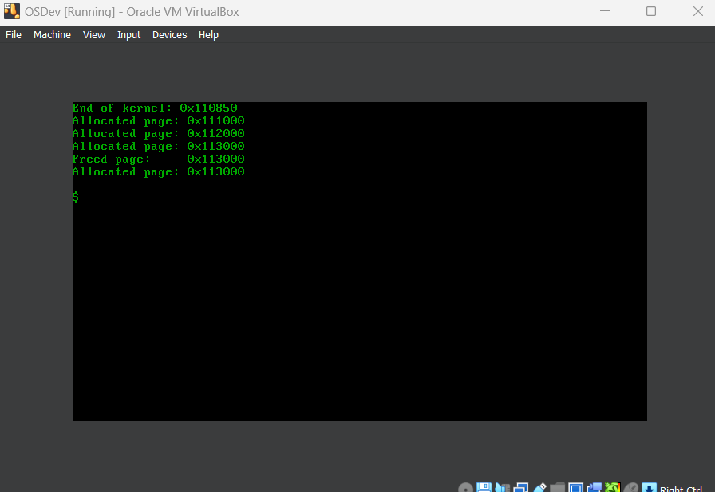

# os-dev
A BIOS bootloader and operating system from scratch. Aims to be UNIX-like.

## Running on VirtualBox
The `os.flp` file needs to be loaded into the the floppy drive of a virtual system. The `Enable I/O APIC` checkbox should be ticked, and the pointing device should be `PS/2 Mouse`.